<div align="center">

#  Практическая Работа: Продвинутое Управление Веб-Сервером Nginx
**Предварительные требования:** Лабораторная работа «Установка и базовая настройка Nginx»  
**Год:** 2026

</div>

---

##  Содержание

- [Практическая Работа: Продвинутое Управление Веб-Сервером Nginx](#практическая-работа-продвинутое-управление-веб-сервером-nginx)
  - [Содержание](#содержание)
  - [Общие сведения о стенде](#общие-сведения-о-стенде)
    - [Топология лабораторной среды](#топология-лабораторной-среды)
    - [Предварительная настройка ВМ](#предварительная-настройка-вм)
    - [Проверка готовности стенда](#проверка-готовности-стенда)
  - [Модуль 01. Виртуальные хосты Nginx](#модуль-01-виртуальные-хосты-nginx)
    - [Теория: архитектура виртуального хостинга](#теория-архитектура-виртуального-хостинга)
    - [1.2. Методы виртуального хостинга](#12-методы-виртуального-хостинга)
      - [1.2.1. Виртуальный хостинг на основе доменного имени (Name-Based)](#121-виртуальный-хостинг-на-основе-доменного-имени-name-based)
      - [1.2.2. Виртуальный хостинг на основе IP-адреса (IP-Based)](#122-виртуальный-хостинг-на-основе-ip-адреса-ip-based)
      - [1.2.3. Виртуальный хостинг на основе порта (Port-Based)](#123-виртуальный-хостинг-на-основе-порта-port-based)
    - [Структура конфигурационных файлов Nginx](#структура-конфигурационных-файлов-nginx)
    - [Практикум: настройка Name-Based Virtual Hosts](#практикум-настройка-name-based-virtual-hosts)
      - [Шаг 1.1  Создание структуры каталогов](#шаг-11--создание-структуры-каталогов)
      - [Шаг 1.2  Создание HTML-страниц](#шаг-12--создание-html-страниц)
      - [Шаг 1.3  Конфигурация серверных блоков](#шаг-13--конфигурация-серверных-блоков)
      - [Шаг 1.4  Активация и тестирование](#шаг-14--активация-и-тестирование)
      - [Шаг 1.5  Локальное разрешение имён в ВМ](#шаг-15--локальное-разрешение-имён-в-вм)
    - [Проверка из Windows-хоста](#проверка-из-windows-хоста)
  - [Модуль 02. Удалённое управление через SSH](#модуль-02-удалённое-управление-через-ssh)
    - [Теория: протокол SSH и аутентификация по ключам](#теория-протокол-ssh-и-аутентификация-по-ключам)
    - [Практикум: генерация ключей в  PowerShell/ OpenSSH](#практикум-генерация-ключей-в--powershell-openssh)
      - [Шаг 2.1  Генерация ключевой пары на ВМ (Linux-сторона)](#шаг-21--генерация-ключевой-пары-на-вм-linux-сторона)
      - [Шаг 2.2  Размещение публичного ключа на сервере](#шаг-22--размещение-публичного-ключа-на-сервере)
  - [Модуль 03. Система доменных имён DNS](#модуль-03-система-доменных-имён-dns)
    - [Теория: принципы работы DNS](#теория-принципы-работы-dns)
    - [Практикум: настройка локального DNS в /etc/hosts](#практикум-настройка-локального-dns-в-etchosts)
  - [Модуль 04. Создание HTTP-сервера на Python](#модуль-04-создание-http-сервера-на-python)
    - [Теория: низкоуровневая работа с протоколом HTTP](#теория-низкоуровневая-работа-с-протоколом-http)
    - [Практикум: поэтапная разработка веб-сервера](#практикум-поэтапная-разработка-веб-сервера)
      - [Шаг 4.1  Создание рабочей директории и тестовых файлов](#шаг-41--создание-рабочей-директории-и-тестовых-файлов)
      - [Шаг 4.2  Базовый TCP-сервер на сокетах](#шаг-42--базовый-tcp-сервер-на-сокетах)
      - [Шаг 4.3  Отправка HTTP-ответа](#шаг-43--отправка-http-ответа)
      - [Шаг 4.4  Парсинг HTTP-запроса и раздача файлов](#шаг-44--парсинг-http-запроса-и-раздача-файлов)
      - [Шаг 4.5  Формирование корректных HTTP-заголовков](#шаг-45--формирование-корректных-http-заголовков)
      - [Шаг 4.6  Обработка ошибок (404 Not Found)](#шаг-46--обработка-ошибок-404-not-found)
      - [Шаг 4.7  Многопоточная обработка соединений](#шаг-47--многопоточная-обработка-соединений)
      - [Шаг 4.8  Файл конфигурации сервера](#шаг-48--файл-конфигурации-сервера)
      - [Шаг 4.9  Ведение журнала доступа (access log)](#шаг-49--ведение-журнала-доступа-access-log)
      - [Шаг 4.10  Ограничение типов файлов (403 Forbidden)](#шаг-410--ограничение-типов-файлов-403-forbidden)
      - [Шаг 4.11  Поддержка бинарных данных (изображения)](#шаг-411--поддержка-бинарных-данных-изображения)
      - [Шаг 4.12  Поддержка постоянных соединений](#шаг-412--поддержка-постоянных-соединений)
    - [Диагностика и отладка](#диагностика-и-отладка)
  - [Поздравляем!](#поздравляем)

---

##  Общие сведения о стенде

### Топология лабораторной среды

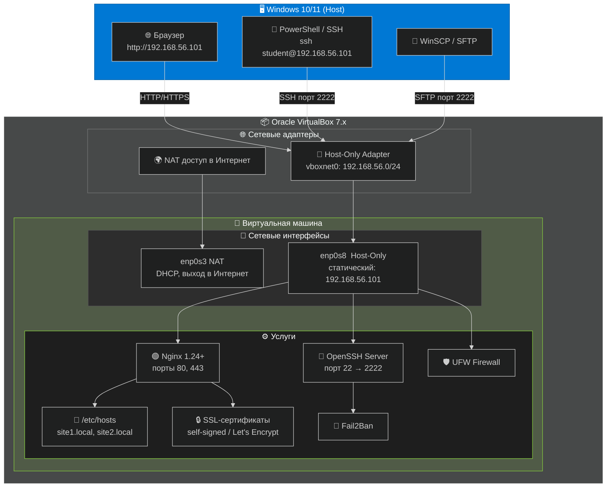

### Предварительная настройка ВМ

> **ВАЖНО: Настройка сети выполняется ДО начала работы!**
>
> В Oracle VirtualBox у вашей ВМ Linux Mint 22 должны быть активны **два** сетевых адаптера:

| Адаптер | Тип | Назначение | Настройка |
|---------|-----|-----------|-----------|
| **Adapter 1** | NAT | Доступ в Интернет (обновления, Certbot) | Включён по умолчанию, DHCP |
| **Adapter 2** | Host-Only | Статический IP для доступа с Windows-хоста | Создайте vboxnet0, отключите DHCP |

**Конфигурация статического IP на ВМ (выполнить в терминале Linux Mint):**

```bash
# Просмотр доступных интерфейсов
ip addr show

# Редактирование конфигурации netplan
sudo nano /etc/netplan/00-installer-config.yaml
```

Содержимое файла:

```yaml
network:
  version: 2
  ethernets:
    enp0s3:                          # NAT-интерфейс
      dhcp4: true
    enp0s8:                          # Host-Only интерфейс
      dhcp4: false
      addresses:
        - 192.168.56.101/24
      nameservers:
        addresses:
          - 8.8.8.8
          - 8.8.4.4
```

```bash
# Применение конфигурации
sudo netplan apply

# Проверка IP-адресов
ip addr show enp0s8
# Ожидаемый результат: inet 192.168.56.101/24
```

**Проверка связности с Windows:**

```bash
# С ВМ Linux Mint  проверка доступности Windows-хоста
ping -c 4 192.168.56.1
```

> ** ПОДСКАЗКА:** IP `192.168.56.1`  это виртуальный интерфейс VirtualBox на вашем Windows-хосте. Убедитесь, что пинг проходит, прежде чем продолжать.

### Проверка готовности стенда

Выполните в терминале ВМ Linux Mint перед началом основной работы:

```bash
#  1. Версия Nginx (должна быть 1.24+)
nginx -v

#  2. Nginx активен
sudo systemctl status nginx --no-pager

#  3. Sudo-привилегии
sudo whoami    # ожидается: root

#  4. Статический IP корректен
ip addr show enp0s8 | grep "192.168.56.101"

#  5. Доступ в Интернет через NAT
ping -c 3 google.com

#  6. SSH-сервер установлен и работает
sudo systemctl status sshd --no-pager
```

---

## Модуль 01. Виртуальные хосты Nginx

### Теория: архитектура виртуального хостинга

**Проблема:** без виртуальных хостов один сервер = один сайт. Для 5 сайтов требуется 5 серверов  неэффективно и дорого.

**Решение:** виртуальные хосты позволяют размещать неограниченное количество сайтов на одном экземпляре Nginx. Сервер анализирует заголовок `Host` HTTP-запроса и направляет его к нужной конфигурации.

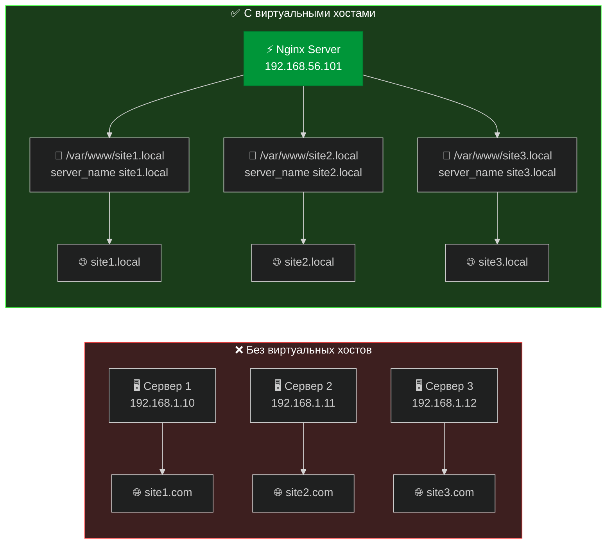
### 1.2. Методы виртуального хостинга

Nginx поддерживает три методологии организации виртуального хостинга:

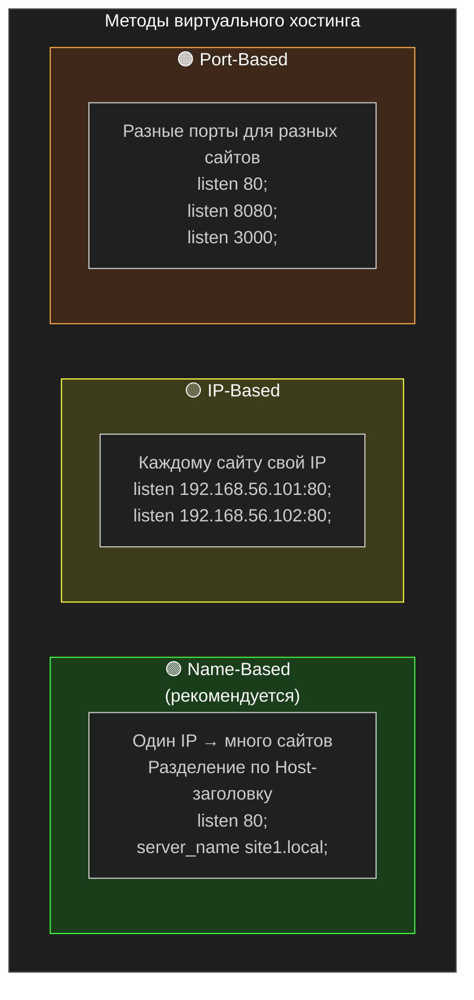

#### 1.2.1. Виртуальный хостинг на основе доменного имени (Name-Based)

Рекомендуемый метод для большинства сценариев эксплуатации. Механизм использует заголовок `Host` HTTP/1.1 для маршрутизации запросов.

```nginx
server {
    listen 80;
    server_name site1.local;
    root /var/www/site1.local;
}

server {
    listen 80;
    server_name site2.local;
    root /var/www/site2.local;
}
```

| Достоинства | Ограничения |
|-------------|-------------|
| Один IP-адрес обслуживает неограниченное количество сайтов | Требуется поддержка HTTP/1.1 клиентом |
| Экономия IP-адресов | Невозможен для протоколов без передачи заголовка Host (устаревшие системы) |
| Наиболее распространённая конфигурация в производственных средах |  |

#### 1.2.2. Виртуальный хостинг на основе IP-адреса (IP-Based)

Каждому веб-сайту выделяется уникальный IP-адрес. Сервер определяет целевой конфигурационный блок по IP-адресу получателя.

```nginx
server {
    listen 192.168.1.10:80;
    root /var/www/site1.local;
}

server {
    listen 192.168.1.11:80;
    root /var/www/site2.local;
}
```

| Достоинства | Ограничения |
|-------------|-------------|
| Совместимость с любыми протоколами транспортного и прикладного уровней | Необходимость выделения множественных IP-адресов |
| Независимость от версии HTTP | Ограниченность IPv4-пространства |

#### 1.2.3. Виртуальный хостинг на основе порта (Port-Based)

Различные веб-сайты обслуживаются на различных TCP-портах.

```nginx
server {
    listen 80;
    root /var/www/site1.local;
}

server {
    listen 8080;
    root /var/www/site2.local;
}
```

| Достоинства | Ограничения |
|-------------|-------------|
| Простота тестирования и отладки | Непрофессиональное отображение URL (указание порта) |
| Отсутствие требований к доменным именам | Необходимость информирования пользователей о нестандартном порте |


### Структура конфигурационных файлов Nginx

Nginx использует строго регламентированную иерархию каталогов для хранения конфигурационных файлов:

```
/etc/nginx/
├── nginx.conf              # Главный конфигурационный файл
├── sites-available/        # Хранилище всех конфигурационных блоков серверов
│   ├── site1.local         # Конфигурация первого виртуального хоста
│   ├── site2.local         # Конфигурация второго виртуального хоста
│   └── default             # Конфигурация по умолчанию
└── sites-enabled/          # Активные конфигурации (символические ссылки)
    ├── site1.local -> ../sites-available/site1.local
    └── site2.local -> ../sites-available/site2.local
```

> **Академическое примечание:** Использование символических ссылок (symlinks) между каталогами `sites-available/` и `sites-enabled/` является канонической практикой в системах на базе Debian/Ubuntu. Данный подход позволяет активировать и деактивировать виртуальные хосты без физического удаления конфигурационных файлов, что обеспечивает атомарность операций и упрощает процедуры отката изменений.
---

### Практикум: настройка Name-Based Virtual Hosts

> ** Цель:** развернуть два виртуальных хоста `site1.local` и `site2.local` на ВМ с IP `192.168.56.101`, доступных через браузер с Windows-хоста.

#### Шаг 1.1  Создание структуры каталогов

```bash
# Создаём корневые директории сайтов
sudo mkdir -p /var/www/site1.local /var/www/site2.local

# Назначаем права (замените student на вашего пользователя)
sudo chown -R $USER:$USER /var/www/site1.local /var/www/site2.local

# Устанавливаем права доступа
sudo chmod -R 755 /var/www/site1.local /var/www/site2.local

# Проверяем
ls -la /var/www/
```

#### Шаг 1.2  Создание HTML-страниц

```bash
# === Сайт 1 ===
cat > /var/www/site1.local/index.html << 'EOF'
<!DOCTYPE html>
<html lang="ru">
<head>
    <meta charset="UTF-8">
    <title>Сайт 1  Виртуальный хост Nginx</title>
    <style>
        * { margin: 0; padding: 0; box-sizing: border-box; }
        body {
            font-family: 'Segoe UI', Tahoma, Geneva, Verdana, sans-serif;
            background: linear-gradient(135deg, #1a1a2e 0%, #16213e 100%);
            color: #eaeaea;
            min-height: 100vh;
            display: flex;
            flex-direction: column;
            align-items: center;
            justify-content: center;
            text-align: center;
        }
        .container { max-width: 600px; padding: 40px; }
        h1 { font-size: 2.5em; margin-bottom: 20px; color: #e94560; }
        .badge {
            display: inline-block;
            background: #0f3460;
            padding: 10px 20px;
            border-radius: 25px;
            margin: 10px;
            font-size: 0.9em;
        }
        .success { color: #4ecca3; font-size: 1.2em; margin-top: 30px; }
        .ip { color: #f5a623; margin-top: 15px; }
    </style>
</head>
<body>
    <div class="container">
        <h1> Сайт 1 работает!</h1>
        <span class="badge">Nginx</span>
        <span class="badge">Virtual Host</span>
        <span class="badge">Linux Mint 22</span>
        <p class="success"> Первый виртуальный хост успешно сконфигурирован</p>
        <p class="ip">Сервер: 192.168.56.101 | Host-Only Adapter</p>
    </div>
</body>
</html>
EOF

# === Сайт 2 ===
cat > /var/www/site2.local/index.html << 'EOF'
<!DOCTYPE html>
<html lang="ru">
<head>
    <meta charset="UTF-8">
    <title>Сайт 2  Виртуальный хост Nginx</title>
    <style>
        * { margin: 0; padding: 0; box-sizing: border-box; }
        body {
            font-family: 'Segoe UI', Tahoma, Geneva, Verdana, sans-serif;
            background: linear-gradient(135deg, #0f2027 0%, #203a43 50%, #2c5364 100%);
            color: #eaeaea;
            min-height: 100vh;
            display: flex;
            flex-direction: column;
            align-items: center;
            justify-content: center;
            text-align: center;
        }
        .container { max-width: 600px; padding: 40px; }
        h1 { font-size: 2.5em; margin-bottom: 20px; color: #4ecca3; }
        .badge {
            display: inline-block;
            background: #1a3c40;
            padding: 10px 20px;
            border-radius: 25px;
            margin: 10px;
            font-size: 0.9em;
        }
        .success { color: #f5a623; font-size: 1.2em; margin-top: 30px; }
        .ip { color: #e94560; margin-top: 15px; }
    </style>
</head>
<body>
    <div class="container">
        <h1> Сайт 2 работает!</h1>
        <span class="badge">Nginx</span>
        <span class="badge">Virtual Host</span>
        <span class="badge">Linux Mint 22</span>
        <p class="success">Второй виртуальный хост успешно сконфигурирован</p>
        <p class="ip">Сервер: 192.168.56.101 | Host-Only Adapter</p>
    </div>
</body>
</html>
EOF
```

#### Шаг 1.3  Конфигурация серверных блоков

```bash
# Создаём конфиг для site1.local
sudo nano /etc/nginx/sites-available/site1.local
```

Вставьте содержимое:

```nginx
server {
    listen 80;
    listen [::]:80;

    server_name site1.local;
    root /var/www/site1.local;
    index index.html;

    location / {
        try_files $uri $uri/ =404;
    }

    # Логи для отладки
    access_log /var/log/nginx/site1.access.log;
    error_log /var/log/nginx/site1.error.log;
}
```

```bash
# Создаём конфиг для site2.local
sudo nano /etc/nginx/sites-available/site2.local
```

```nginx
server {
    listen 80;
    listen [::]:80;

    server_name site2.local;
    root /var/www/site2.local;
    index index.html;

    location / {
        try_files $uri $uri/ =404;
    }

    access_log /var/log/nginx/site2.access.log;
    error_log /var/log/nginx/site2.error.log;
}
```

#### Шаг 1.4  Активация и тестирование

```bash
# Активируем через символические ссылки
sudo ln -s /etc/nginx/sites-available/site1.local /etc/nginx/sites-enabled/
sudo ln -s /etc/nginx/sites-available/site2.local /etc/nginx/sites-enabled/

# Удаляем дефолтный хост (чтобы не конфликтовал)
sudo rm -f /etc/nginx/sites-enabled/default

# Проверка синтаксиса  ВСЕГДА перед reload!
sudo nginx -t

# Перезагрузка конфигурации
sudo systemctl reload nginx

# Проверка статуса
sudo systemctl status nginx --no-pager
```

#### Шаг 1.5  Локальное разрешение имён в ВМ

```bash
# Редактируем файл hosts
sudo nano /etc/hosts
```

Добавьте строки:

```
192.168.56.101    site1.local
192.168.56.101    site2.local
```

Проверка внутри ВМ:

```bash
curl -s http://site1.local | grep "title"
curl -s http://site2.local | grep "title"
```

---

### Проверка из Windows-хоста

> **🪟 Для доступа к сайтам с Windows необходимо добавить записи в файл `hosts` Windows!**

**Путь к файлу hosts в Windows:** `C:\Windows\System32\drivers\etc\hosts`

Откройте Блокнот **от имени Администратора** → Файл → Открыть → вставьте путь выше.

Добавьте строки:

```
192.168.56.101    site1.local
192.168.56.101    site2.local
```

Сохраните (`Ctrl+S`).

**Проверка с Windows:**

```powershell
# В PowerShell или CMD:
ping site1.local
ping site2.local
```

Откройте браузер на Windows:
- 🌐 `http://site1.local`  должен открыться Сайт 1 (красная тема)
- 🌐 `http://site2.local`  должен открыться Сайт 2 (зелёная тема)

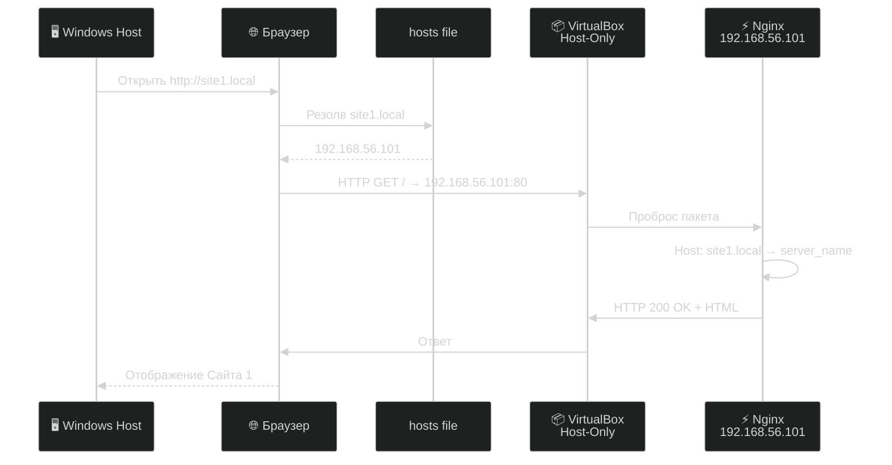

> ** Результат модуля:** Два виртуальных хоста развёрнуты и доступны через браузер Windows по адресам `http://site1.local` и `http://site2.local`.

---

## Модуль 02. Удалённое управление через SSH

### Теория: протокол SSH и аутентификация по ключам

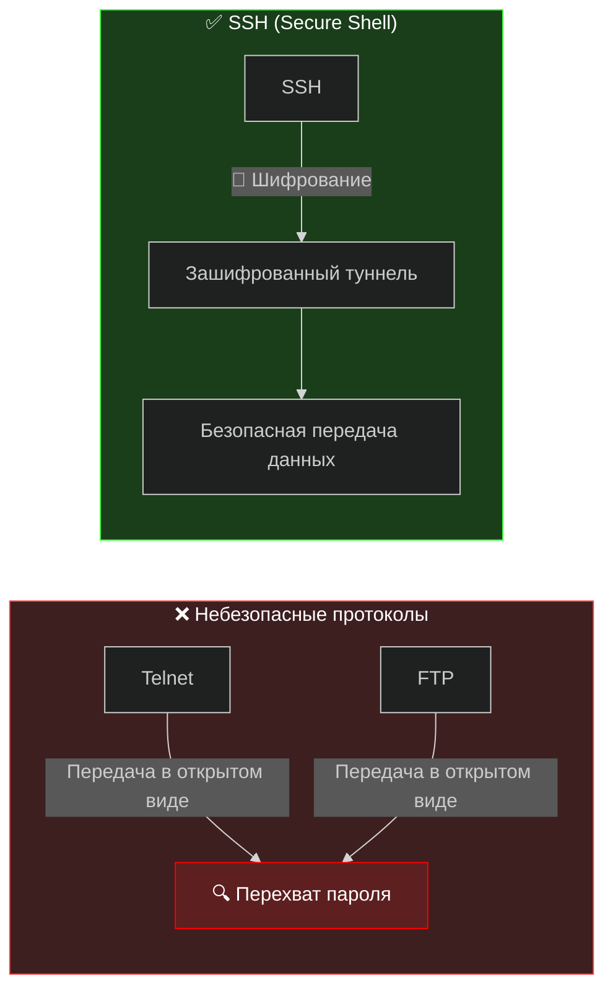

**Схема аутентификации по ключевой паре:**

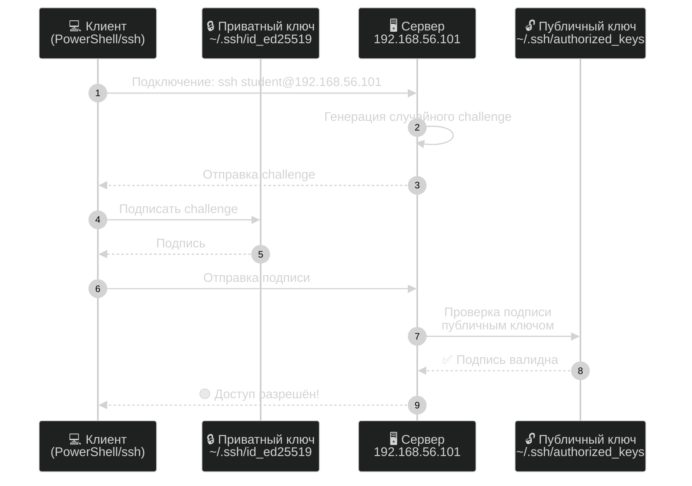

**Алгоритмы генерации ключей:**

| Алгоритм | Размер ключа | Безопасность | Рекомендация |
|----------|-------------|--------------|--------------|
| **Ed25519** | 256 бит | Высокая |  **Рекомендуется**  быстрый, современный |
| RSA | 4096 бит | Высокая |  Совместимость со старыми системами |
| ECDSA | 521 бит | Средняя |  Потенциальные проблемы с NSA-куривными |

---

### Практикум: генерация ключей в  PowerShell/ OpenSSH

#### Шаг 2.1  Генерация ключевой пары на ВМ (Linux-сторона)

```bash
# Создаём директорию .ssh (если нет)
mkdir -p ~/.ssh && chmod 700 ~/.ssh

# Генерация Ed25519 ключа
ssh-keygen -t ed25519 -a 100 -C "student@lab-mint"

# При запросе:
# Enter file: [Enter  по умолчанию ~/.ssh/id_ed25519]
# Enter passphrase: [Введите надёжную passphrase  ОБЯЗАТЕЛЬНО!]
# Confirm passphrase: [Повторите]
```

**Просмотр созданных ключей:**

```bash
ls -la ~/.ssh/
# Должно быть:
# - id_ed25519      (приватный, права 600)
# - id_ed25519.pub  (публичный, права 644)
```

#### Шаг 2.2  Размещение публичного ключа на сервере

```bash
# Копируем публичный ключ в authorized_keys
cat ~/.ssh/id_ed25519.pub >> ~/.ssh/authorized_keys
chmod 600 ~/.ssh/authorized_keys

# Проверяем содержимое
cat ~/.ssh/authorized_keys
# Должна быть строка, начинающаяся с ssh-ed25519 ...
```


---

## Модуль 03. Система доменных имён DNS

### Теория: принципы работы DNS

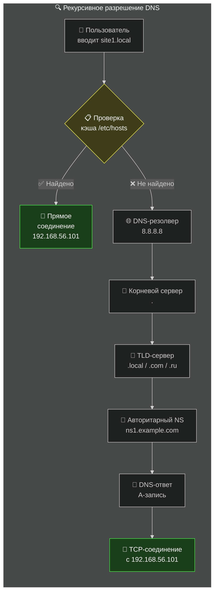

**Основные типы DNS-записей:**

| Тип | Назначение | Пример |
|-----|-----------|--------|
| **A** | Домен → IPv4-адрес | `site1.local. IN A 192.168.56.101` |
| **AAAA** | Домен → IPv6-адрес | `site1.local. IN AAAA ::1` |
| **CNAME** | Псевдоним (алиас) | `www.site1.local. IN CNAME site1.local.` |
| **MX** | Почтовый сервер | `site1.local. IN MX 10 mail.site1.local.` |

---

### Практикум: настройка локального DNS в /etc/hosts

В лабораторной среде без полноценного DNS-сервера разрешение имён выполняется через файл `hosts`.

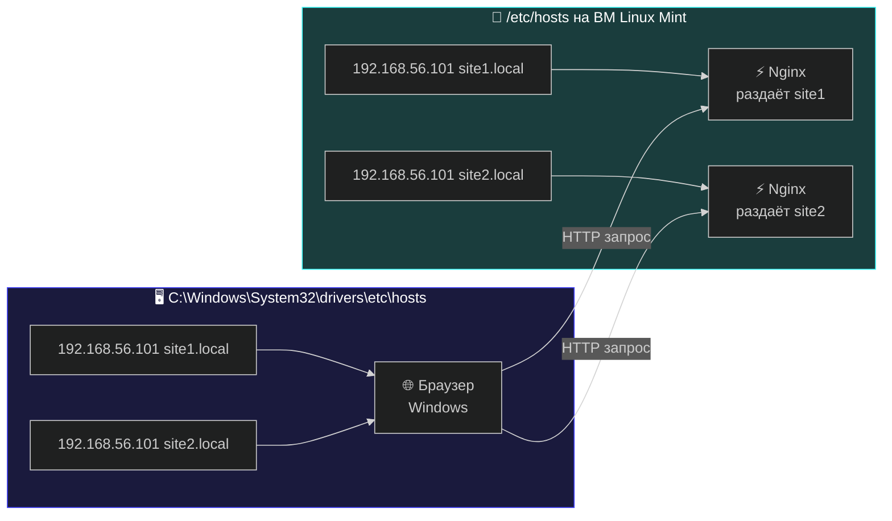

**На ВМ Linux Mint:**

```bash
# Проверка текущего содержимого
cat /etc/hosts

# Добавление записей (если ещё не добавлены в Модуле 01)
sudo tee -a /etc/hosts << 'EOF'
192.168.56.101    site1.local
192.168.56.101    site2.local
EOF

# Проверка
cat /etc/hosts | grep site
```

**На Windows-хосте:**

```powershell
# Открыть Блокнот от имени Администратора → C:\Windows\System32\drivers\etc\hosts
# Добавить:
# 192.168.56.101    site1.local
# 192.168.56.101    site2.local

# Проверка в PowerShell:
ping site1.local
# Ожидается ответ от 192.168.56.101
```

**Диагностика DNS:**

```bash
# В Linux:
getent hosts site1.local
nslookup site1.local
dig site1.local

# Трассировка полного пути
dig +trace google.com
```

> ** Теория:** Файл `/etc/hosts` имеет **наивысший приоритет** при разрешении имён (до обращения к DNS). Это управляется файлом `/etc/nsswitch.conf` (строка `hosts: files dns`). Для лабораторной среды это позволяет имитировать полноценную DNS-инфраструктуру.


---


## Модуль 04. Создание HTTP-сервера на Python

> ** Цель модуля:** освоить низкоуровневую работу с протоколом HTTP, научиться создавать веб-сервер с использованием TCP-сокетов в Python, понять структуру HTTP-запросов и ответов, реализовать полнофункциональный многопоточный сервер с поддержкой раздачи статических файлов, журналирования и конфигурации.
>
> **🔗 Источник:** [github.com/fa-python-network/6_Web_server](https://github.com/fa-python-network/6_Web_server)

---

### Теория: низкоуровневая работа с протоколом HTTP

**Протокол HTTP (HyperText Transfer Protocol)**  прикладной протокол передачи данных, лежащий в основе работы Всемирной паутины. HTTP работает по схеме «запросответ» между клиентом (обычно браузером) и сервером.

#### Структура HTTP-запроса

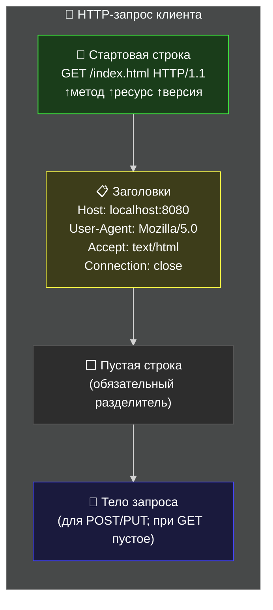

**Первая строка (Request Line)**  самая важная часть запроса. Содержит три элемента, разделённых пробелами:

| Элемент | Описание | Примеры |
|---------|----------|---------|
| **Метод** | Действие, которое нужно выполнить | `GET`, `POST`, `HEAD`, `PUT`, `DELETE` |
| **URI** | Унифицированный идентификатор ресурса | `/`, `/index.html`, `/css/style.css` |
| **Версия HTTP** | Версия протокола | `HTTP/1.0`, `HTTP/1.1` |

> **💡 ПОДСКАЗКА:** В данной лабораторной работе мы фокусируемся на методе `GET`, поскольку он используется браузером для получения веб-страниц. Метод `GET` не имеет тела запроса  пустая строка сразу следует за заголовками.

#### Структура HTTP-ответа

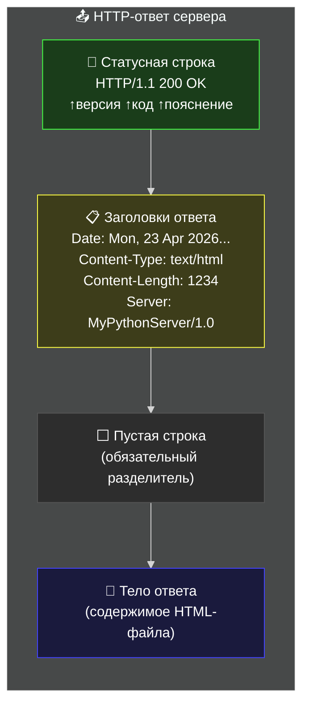

#### Коды состояния HTTP

| Код | Значение | Когда используется |
|-----|----------|-------------------|
| **200** | OK | Запрос выполнен успешно |
| **301** | Moved Permanently | Ресурс перемещён на другой URL |
| **400** | Bad Request | Некорректный синтаксис запроса |
| **403** | Forbidden | Доступ к ресурсу запрещён |
| **404** | Not Found | Запрошенный ресурс не найден |
| **500** | Internal Server Error | Внутренняя ошибка сервера |
| **505** | HTTP Version Not Supported | Версия HTTP не поддерживается |

#### Python-модуль `socket`

Для создания сетевых приложений в Python используется встроенный модуль `socket`. Он предоставляет доступ к низкоуровневому API сетевых соединений на базе протокола TCP/IP.

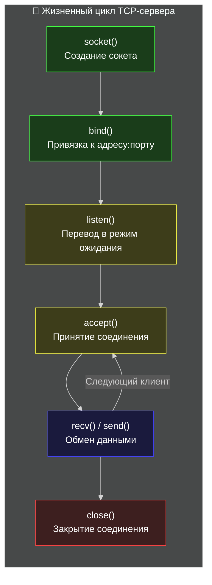

> **⚠️ ВАЖНО:** Порт 80  привилегированный порт (номер < 1024). Для его использования требуются права суперпользователя (`sudo`). В лабораторной работе рекомендуется использовать порт **8080**, чтобы не запускать сервер с `sudo`. В браузере тогда URL будет: `http://localhost:8080`.

---

### Практикум: поэтапная разработка веб-сервера

> **🎓 Методика:** Каждый следующий шаг является расширением предыдущего. Сохраняйте резервные копии (`server_v1.py`, `server_v2.py` и т.д.), чтобы можно было вернуться к рабочей версии.

#### Шаг 4.1  Создание рабочей директории и тестовых файлов

Перед началом программирования подготовим структуру рабочей директории и тестовые HTML-файлы.

```bash
# Создаём рабочую директорию в домашней папке
mkdir -p ~/pywebserver/www
cd ~/pywebserver

# Создаём простую тестовую страницу 1.html
cat > ~/pywebserver/www/1.html << 'EOF'
<!DOCTYPE html>
<html lang="ru">
<head>
    <meta charset="UTF-8">
    <title>Первый файл</title>
    <style>
        body { font-family: Arial, sans-serif; background: #1a1a2e; color: #fff;
               display: flex; justify-content: center; align-items: center; height: 100vh; margin: 0; }
        h1 { color: #4ecca3; }
    </style>
</head>
<body>
    <h1>Первый файл</h1>
</body>
</html>
EOF

# Создаём простую тестовую страницу 2.html
cat > ~/pywebserver/www/2.html << 'EOF'
<!DOCTYPE html>
<html lang="ru">
<head>
    <meta charset="UTF-8">
    <title>Второй файл</title>
    <style>
        body { font-family: Arial, sans-serif; background: #16213e; color: #fff;
               display: flex; justify-content: center; align-items: center; height: 100vh; margin: 0; }
        h1 { color: #e94560; }
    </style>
</head>
<body>
    <h1>Второй файл</h1>
</body>
</html>
EOF

# Создаём главную страницу index.html
cat > ~/pywebserver/www/index.html << 'EOF'
<!DOCTYPE html>
<html lang="ru">
<head>
    <meta charset="UTF-8">
    <title>Главная страница  Python Web Server</title>
    <style>
        body { font-family: 'Segoe UI', sans-serif; background: linear-gradient(135deg, #1a1a2e 0%, #16213e 100%);
               color: #eaeaea; min-height: 100vh; display: flex; flex-direction: column;
               align-items: center; justify-content: center; text-align: center; margin: 0; }
        h1 { color: #4ecca3; font-size: 2.5em; margin-bottom: 10px; }
        .badge { background: #0f3460; padding: 8px 16px; border-radius: 20px; margin: 5px; display: inline-block; }
        .info { color: #f5a623; margin-top: 20px; }
        a { color: #4ecca3; }
    </style>
</head>
<body>
    <h1>Python Web Server работает!</h1>
    <span class="badge">Python 3</span>
    <span class="badge">socket</span>
    <span class="badge">HTTP/1.1</span>
    <p class="info">Тестовые страницы: <a href="1.html">1.html</a> | <a href="2.html">2.html</a></p>
</body>
</html>
EOF

# Проверяем структуру
ls -la ~/pywebserver/www/
```

> ** Проверка:** В директории `~/pywebserver/www/` должны быть три файла: `index.html`, `1.html`, `2.html`.

---

#### Шаг 4.2  Базовый TCP-сервер на сокетах

Создадим минимальный TCP-сервер, который принимает соединение и выводит на экран данные, полученные от клиента.

```bash
# Создаём файл сервера
nano ~/pywebserver/server.py
```

Вставьте код:

```python
import socket

# Создаём TCP-сокет
# socket.AF_INET  адресное семейство IPv4
# socket.SOCK_STREAM  протокол TCP (потоковый)
sock = socket.socket(socket.AF_INET, socket.SOCK_STREAM)

try:
    # Пытаемся привязаться к порту 80 (стандартный HTTP-порт)
    # '' означает привязку ко всем доступным сетевым интерфейсам
    sock.bind(('', 80))
    print("Using port 80")
except OSError:
    # Если порт 80 занят (требует root)  используем 8080
    sock.bind(('', 8080))
    print("Using port 8080")

# Переводим сокет в режим прослушивания
# Параметр 5  размер очереди ожидающих соединений (backlog)
sock.listen(5)

print("Сервер запущен. Ожидание подключений...")

# accept() блокирует выполнение до подключения клиента
# Возвращает кортеж: (новый_сокет_для_общения, адрес_клиента)
conn, addr = sock.accept()
print("Connected", addr)

# Получаем данные от клиента (максимум 8192 байт)
data = conn.recv(8192)
msg = data.decode()

# Выводим HTTP-запрос на экран
print(msg)

# Закрываем соединение
conn.close()
```

**Запуск и проверка:**

```bash
# Запускаем сервер в терминале 1
cd ~/pywebserver
python3 server.py
# Ожидаемый вывод:
# Using port 8080
# Сервер запущен. Ожидание подключений...
```

```bash
# В терминале 2 (не закрывайте первый!) отправляем тестовый запрос:
curl http://localhost:8080

# Или откройте браузер и перейдите на http://localhost:8080
```

> **Что происходит:** После подключения клиента сервер выведет на экран полный HTTP-запрос. Пример:
>
> ```
> GET / HTTP/1.1
> Host: localhost:8080
> User-Agent: curl/7.81.0
> Accept: */*
> ```

> **⛔ Проблема:** Сервер принимает только **одно** соединение и завершается. Браузер может показать ошибку, так как сервер не отправляет ответ. Это исправим в следующем шаге.

---

#### Шаг 4.3  Отправка HTTP-ответа

Добавим отправку корректного HTTP-ответа клиенту. Ключевое правило: между заголовками и телом ответа должна быть **пустая строка**.

```bash
nano ~/pywebserver/server.py
```

Обновлённый код:

```python
import socket

sock = socket.socket(socket.AF_INET, socket.SOCK_STREAM)

try:
    sock.bind(('', 80))
    print("Using port 80")
except OSError:
    sock.bind(('', 8080))
    print("Using port 8080")

sock.listen(5)
print("Сервер запущен. Ожидание подключений...")

conn, addr = sock.accept()
print("Connected", addr)

data = conn.recv(8192)
msg = data.decode()
print(msg)

# Формируем HTTP-ответ
# ВАЖНО: пустая строка между заголовками и телом  ОБЯЗАТЕЛЬНА!
resp = """HTTP/1.1 200 OK
Server: SelfMadeServer v0.0.1
Content-type: text/html
Connection: close

Hello, webworld!"""

# Отправляем ответ клиенту (кодируем строку в байты)
conn.send(resp.encode())

# Закрываем соединение
conn.close()
```

```bash
# Перезапускаем сервер
cd ~/pywebserver
python3 server.py
```

```bash
# В другом терминале проверяем
curl -v http://localhost:8080
# Ожидается: Hello, webworld!
```

> **💡 ПОДСКАЗКА:** Флаг `-v` в curl включает подробный вывод  вы увидите и отправленные заголовки, и полученные. Это незаменимый инструмент для отладки HTTP.

> ** ТЕОРИЯ:** Обратите внимание на структуру переменной `resp`. Пустая строка (`\n`) отделяет заголовки от тела ответа. Без неё браузер не распознает тело и не отобразит страницу. Это одна из самых частых ошибок при ручной сборке HTTP-ответов.

---

#### Шаг 4.4  Парсинг HTTP-запроса и раздача файлов

Теперь сервер должен:
1. Распарсить запрашиваемый ресурс из первой строки HTTP-запроса
2. Прочитать соответствующий файл из рабочей директории
3. Отправить содержимое файла в ответе
4. Если ресурс не указан (`/`)  отдать `index.html`

```python
import socket
import os

# === Конфигурация ===
WWW_DIR = os.path.join(os.path.dirname(__file__), 'www')
DEFAULT_PAGE = 'index.html'

def parse_request(request_text):
    """Извлекает путь к ресурсу из первой строки HTTP-запроса.

    Пример: 'GET /1.html HTTP/1.1' -> '/1.html'
    """
    lines = request_text.splitlines()
    if not lines:
        return None

    first_line = lines[0]
    parts = first_line.split()

    # parts[0] = метод (GET), parts[1] = путь, parts[2] = версия HTTP
    if len(parts) < 3:
        return None

    return parts[1]

def get_file_path(uri):
    """Преобразует URI в безопасный путь к файлу.

    /        -> www/index.html
    /1.html  -> www/1.html
    """
    # Убираем начальный слеш
    if uri.startswith('/'):
        uri = uri[1:]

    # Если путь пустой  используем страницу по умолчанию
    if not uri:
        uri = DEFAULT_PAGE

    # Формируем полный путь
    return os.path.join(WWW_DIR, uri)

# === Основной код сервера ===
sock = socket.socket(socket.AF_INET, socket.SOCK_STREAM)

try:
    sock.bind(('', 80))
    print("Using port 80")
except OSError:
    sock.bind(('', 8080))
    print("Using port 8080")

sock.listen(5)
print("Сервер запущен. Ожидание подключений...")

while True:
    conn, addr = sock.accept()
    print("Connected", addr)

    data = conn.recv(8192)
    msg = data.decode()
    print(msg)

    # Парсим запрос
    uri = parse_request(msg)
    print(f"Запрошен ресурс: {uri}")

    # Определяем путь к файлу
    file_path = get_file_path(uri)
    print(f"Путь к файлу: {file_path}")

    # Проверяем существование файла
    if os.path.exists(file_path) and os.path.isfile(file_path):
        # Читаем содержимое файла
        with open(file_path, 'r') as f:
            content = f.read()

        # Формируем успешный ответ
        resp = f"""HTTP/1.1 200 OK
Content-type: text/html
Connection: close

{content}"""
    else:
        # Файл не найден
        resp = """HTTP/1.1 404 Not Found
Content-type: text/html
Connection: close

<h1>404 Not Found</h1>"""

    conn.send(resp.encode())
    conn.close()
```

```bash
# Перезапускаем и тестируем
cd ~/pywebserver
python3 server.py
```

```bash
# Тесты в другом терминале:
curl http://localhost:8080          # -> содержимое index.html
curl http://localhost:8080/1.html   # -> содержимое 1.html
curl http://localhost:8080/2.html   # -> содержимое 2.html
curl http://localhost:8080/none     # -> 404 Not Found
```

> **⚠️ ВАЖНО:** Обратите внимание на конструкцию `while True:`  теперь сервер работает постоянно, принимая одно соединение за другим. Однако он всё ещё обрабатывает соединения **последовательно**: пока один клиент не отключится, следующий будет ждать.

---

#### Шаг 4.5  Формирование корректных HTTP-заголовков

Профессиональный веб-сервер обязательно включает в ответ определённые заголовки. Добавим недостающие.

| Заголовок | Назначение | Пример значения |
|-----------|-----------|-----------------|
| **Date** | Дата и время формирования ответа по GMT | `Date: Mon, 23 Apr 2026 12:00:00 GMT` |
| **Content-Type** | MIME-тип содержимого | `text/html`, `text/css`, `image/png` |
| **Server** | Идентификация серверного ПО | `MyPythonServer/1.0` |
| **Content-Length** | Размер тела ответа в байтах | `Content-Length: 1234` |
| **Connection** | Управление соединением | `close` или `keep-alive` |

```python
import socket
import os
import datetime

WWW_DIR = os.path.join(os.path.dirname(__file__), 'www')
DEFAULT_PAGE = 'index.html'

def parse_request(request_text):
    lines = request_text.splitlines()
    if not lines:
        return None
    parts = lines[0].split()
    return parts[1] if len(parts) >= 3 else None

def get_file_path(uri):
    if uri.startswith('/'):
        uri = uri[1:]
    if not uri:
        uri = DEFAULT_PAGE
    return os.path.join(WWW_DIR, uri)

def build_headers(content_length, content_type='text/html', connection='close'):
    """Формирует обязательные HTTP-заголовки."""
    # GMT-дата в формате RFC 7231
    date_str = datetime.datetime.utcnow().strftime('%a, %d %b %Y %H:%M:%S GMT')

    headers = f"""Date: {date_str}
Server: MyPythonServer/1.0
Content-Type: {content_type}
Content-Length: {content_length}
Connection: {connection}"""
    return headers

# === Сервер ===
sock = socket.socket(socket.AF_INET, socket.SOCK_STREAM)

try:
    sock.bind(('', 80))
    print("Using port 80")
except OSError:
    sock.bind(('', 8080))
    print("Using port 8080")

sock.listen(5)
print("Сервер запущен. Ожидание подключений...")

while True:
    conn, addr = sock.accept()
    print("Connected", addr)

    data = conn.recv(8192)
    msg = data.decode()

    uri = parse_request(msg)
    file_path = get_file_path(uri)

    if os.path.exists(file_path) and os.path.isfile(file_path):
        with open(file_path, 'r') as f:
            content = f.read()

        headers = build_headers(len(content.encode('utf-8')))
        resp = f"""HTTP/1.1 200 OK
{headers}

{content}"""
    else:
        body = "<h1>404 Not Found</h1>"
        headers = build_headers(len(body.encode('utf-8')))
        resp = f"""HTTP/1.1 404 Not Found
{headers}

{body}"""

    conn.send(resp.encode())
    conn.close()
```

> **💡 ПОДСКАЗКА:** Заголовок `Content-Length` требует точного размера тела ответа в байтах, а не в символах. Для строк с многобайтовыми символами (русский текст в UTF-8) используйте `len(content.encode('utf-8'))`, а не просто `len(content)`.

---

#### Шаг 4.6  Обработка ошибок (404 Not Found)

Улучшим страницу ошибки 404, чтобы она выглядела профессионально, и добавим обработку других ошибок.

```python
def generate_error_page(status_code, status_text, description=""):
    """Генерирует HTML-страницу для ошибки."""
    html = f"""<!DOCTYPE html>
<html lang="ru">
<head>
    <meta charset="UTF-8">
    <title>{status_code} {status_text}</title>
    <style>
        body {{ font-family: 'Segoe UI', sans-serif; background: #1a1a2e; color: #fff;
                display: flex; flex-direction: column; align-items: center;
                justify-content: center; height: 100vh; margin: 0; text-align: center; }}
        .code {{ font-size: 6em; color: #e94560; margin: 0; }}
        .text {{ font-size: 1.5em; color: #f5a623; }}
        .desc {{ color: #888; margin-top: 20px; }}
    </style>
</head>
<body>
    <p class="code">{status_code}</p>
    <p class="text">{status_text}</p>
    <p class="desc">{description}</p>
</body>
</html>"""
    return html

# В основном цикле замените блок 404 на:
else:
    body = generate_error_page(404, "Not Found", f"Файл не найден: {uri}")
    headers = build_headers(len(body.encode('utf-8')))
    resp = f"""HTTP/1.1 404 Not Found
{headers}

{body}"""
```

> **Тестирование:** Откройте в браузере `http://localhost:8080/nonexistent`  вы должны увидеть красивую страницу с кодом 404.

---

#### Шаг 4.7  Многопоточная обработка соединений

Сервер должен обрабатывать несколько клиентов **одновременно**. Для этого используем модуль `threading`.

```python
import socket
import os
import datetime
import threading  # Импорт модуля для многопоточности

WWW_DIR = os.path.join(os.path.dirname(__file__), 'www')
DEFAULT_PAGE = 'index.html'

def parse_request(request_text):
    lines = request_text.splitlines()
    if not lines:
        return None
    parts = lines[0].split()
    return parts[1] if len(parts) >= 3 else None

def get_file_path(uri):
    if uri.startswith('/'):
        uri = uri[1:]
    if not uri:
        uri = DEFAULT_PAGE
    return os.path.join(WWW_DIR, uri)

def build_headers(content_length, content_type='text/html', connection='close'):
    date_str = datetime.datetime.utcnow().strftime('%a, %d %b %Y %H:%M:%S GMT')
    return f"""Date: {date_str}
Server: MyPythonServer/1.0
Content-Type: {content_type}
Content-Length: {content_length}
Connection: {connection}"""

def generate_error_page(status_code, status_text, description=""):
    html = f"""<!DOCTYPE html>
<html lang="ru">
<head>
    <meta charset="UTF-8">
    <title>{status_code} {status_text}</title>
    <style>
        body {{ font-family: 'Segoe UI', sans-serif; background: #1a1a2e; color: #fff;
                display: flex; flex-direction: column; align-items: center;
                justify-content: center; height: 100vh; margin: 0; text-align: center; }}
        .code {{ font-size: 6em; color: #e94560; margin: 0; }}
        .text {{ font-size: 1.5em; color: #f5a623; }}
        .desc {{ color: #888; margin-top: 20px; }}
    </style>
</head>
<body>
    <p class="code">{status_code}</p>
    <p class="text">{status_text}</p>
    <p class="desc">{description}</p>
</body>
</html>"""
    return html

def handle_client(conn, addr):
    """Обрабатывает одно клиентское соединение в отдельном потоке."""
    print(f"[+] Клиент {addr} подключён")

    try:
        data = conn.recv(8192)
        if not data:
            return

        msg = data.decode()
        uri = parse_request(msg)

        if uri is None:
            # Некорректный запрос
            body = generate_error_page(400, "Bad Request", "Некорректный формат HTTP-запроса")
            headers = build_headers(len(body.encode('utf-8')))
            resp = f"""HTTP/1.1 400 Bad Request
{headers}

{body}"""
        else:
            file_path = get_file_path(uri)

            if os.path.exists(file_path) and os.path.isfile(file_path):
                with open(file_path, 'r') as f:
                    content = f.read()
                headers = build_headers(len(content.encode('utf-8')))
                resp = f"""HTTP/1.1 200 OK
{headers}

{content}"""
            else:
                body = generate_error_page(404, "Not Found", f"Файл не найден: {uri}")
                headers = build_headers(len(body.encode('utf-8')))
                resp = f"""HTTP/1.1 404 Not Found
{headers}

{body}"""

        conn.send(resp.encode())
    except Exception as e:
        print(f"[!] Ошибка обработки клиента {addr}: {e}")
    finally:
        conn.close()
        print(f"[-] Клиент {addr} отключён")

# === Основной цикл сервера ===
sock = socket.socket(socket.AF_INET, socket.SOCK_STREAM)
sock.setsockopt(socket.SOL_SOCKET, socket.SO_REUSEADDR, 1)  # Повторное использование адреса

try:
    sock.bind(('', 80))
    print("Using port 80")
except OSError:
    sock.bind(('', 8080))
    print("Using port 8080")

sock.listen(5)
print("Многопоточный сервер запущен. Ожидание подключений...")
print("Нажмите Ctrl+C для остановки.")

try:
    while True:
        conn, addr = sock.accept()
        # Создаём новый поток для каждого клиента
        client_thread = threading.Thread(target=handle_client, args=(conn, addr))
        client_thread.daemon = True  # Поток завершится при выходе из программы
        client_thread.start()
        print(f"[i] Активных потоков: {threading.active_count() - 1}")
except KeyboardInterrupt:
    print("\n[!] Сервер остановлен по запросу пользователя")
finally:
    sock.close()
```

> **💡 ПОДСКАЗКА:** `socket.SO_REUSEADDR` позволяет повторно использовать локальный адрес сразу после перезапуска сервера. Без этого флага при быстром перезапуске вы получите ошибку `Address already in use`.

> **Тестирование многопоточности:** Откройте **несколько** вкладок браузера и одновременно обратитесь к серверу. Все запросы должны обрабатываться параллельно без очереди.

---

#### Шаг 4.8  Файл конфигурации сервера

Вынесем настройки сервера в отдельный файл `config.ini`. Это позволит изменять параметры без правки кода.

```bash
# Создаём файл конфигурации
cat > ~/pywebserver/config.ini << 'EOF'
[server]
port = 8080
www_dir = www
max_request_size = 8192

[headers]
server_name = MyPythonServer/1.0
EOF
```

```python
import socket
import os
import datetime
import threading
import configparser  # Модуль для работы с INI-файлами

# === Загрузка конфигурации ===
config = configparser.ConfigParser()
config.read('config.ini')

PORT = config.getint('server', 'port', fallback=8080)
WWW_DIR = config.get('server', 'www_dir', fallback='www')
MAX_REQUEST_SIZE = config.getint('server', 'max_request_size', fallback=8192)
SERVER_NAME = config.get('headers', 'server_name', fallback='MyPythonServer/1.0')

# Преобразуем относительный путь в абсолютный
if not os.path.isabs(WWW_DIR):
    WWW_DIR = os.path.join(os.path.dirname(__file__), WWW_DIR)

DEFAULT_PAGE = 'index.html'

def parse_request(request_text):
    lines = request_text.splitlines()
    if not lines:
        return None
    parts = lines[0].split()
    return parts[1] if len(parts) >= 3 else None

def get_file_path(uri):
    if uri.startswith('/'):
        uri = uri[1:]
    if not uri:
        uri = DEFAULT_PAGE
    return os.path.join(WWW_DIR, uri)

def build_headers(content_length, content_type='text/html', connection='close'):
    date_str = datetime.datetime.utcnow().strftime('%a, %d %b %Y %H:%M:%S GMT')
    return f"""Date: {date_str}
Server: {SERVER_NAME}
Content-Type: {content_type}
Content-Length: {content_length}
Connection: {connection}"""

def generate_error_page(status_code, status_text, description=""):
    html = f"""<!DOCTYPE html>
<html lang="ru">
<head>
    <meta charset="UTF-8">
    <title>{status_code} {status_text}</title>
    <style>
        body {{ font-family: 'Segoe UI', sans-serif; background: #1a1a2e; color: #fff;
                display: flex; flex-direction: column; align-items: center;
                justify-content: center; height: 100vh; margin: 0; text-align: center; }}
        .code {{ font-size: 6em; color: #e94560; margin: 0; }}
        .text {{ font-size: 1.5em; color: #f5a623; }}
        .desc {{ color: #888; margin-top: 20px; }}
    </style>
</head>
<body>
    <p class="code">{status_code}</p>
    <p class="text">{status_text}</p>
    <p class="desc">{description}</p>
</body>
</html>"""
    return html

def handle_client(conn, addr):
    print(f"[+] Клиент {addr} подключён")
    try:
        data = conn.recv(MAX_REQUEST_SIZE)
        if not data:
            return

        msg = data.decode()
        uri = parse_request(msg)

        if uri is None:
            body = generate_error_page(400, "Bad Request")
            headers = build_headers(len(body.encode('utf-8')))
            resp = f"""HTTP/1.1 400 Bad Request
{headers}

{body}"""
        else:
            file_path = get_file_path(uri)

            if os.path.exists(file_path) and os.path.isfile(file_path):
                with open(file_path, 'r') as f:
                    content = f.read()
                headers = build_headers(len(content.encode('utf-8')))
                resp = f"""HTTP/1.1 200 OK
{headers}

{content}"""
            else:
                body = generate_error_page(404, "Not Found", f"Файл не найден: {uri}")
                headers = build_headers(len(body.encode('utf-8')))
                resp = f"""HTTP/1.1 404 Not Found
{headers}

{body}"""

        conn.send(resp.encode())
    except Exception as e:
        print(f"[!] Ошибка: {e}")
    finally:
        conn.close()
        print(f"[-] Клиент {addr} отключён")

# --- Сервер ---
sock = socket.socket(socket.AF_INET, socket.SOCK_STREAM)
sock.setsockopt(socket.SOL_SOCKET, socket.SO_REUSEADDR, 1)

try:
    sock.bind(('', PORT))
    print(f"Using port {PORT}")
except OSError:
    fallback_port = 8080 if PORT != 8080 else 8081
    sock.bind(('', fallback_port))
    print(f"Port {PORT} unavailable, using port {fallback_port}")

sock.listen(5)
print(f"Сервер {SERVER_NAME} запущен на порту {PORT}")
print("Нажмите Ctrl+C для остановки.")

try:
    while True:
        conn, addr = sock.accept()
        client_thread = threading.Thread(target=handle_client, args=(conn, addr))
        client_thread.daemon = True
        client_thread.start()
except KeyboardInterrupt:
    print("\n[!] Сервер остановлен")
finally:
    sock.close()
```

> **💡 ПОДСКАЗКА:** Модуль `configparser` работает с INI-файлами структуры `[section] key = value`. Методы `get()`, `getint()`, `getboolean()` имеют параметр `fallback`  значение по умолчанию, если параметр не найден в файле. Это делает конфигурацию надёжной.

---

#### Шаг 4.9  Ведение журнала доступа (access log)

Профессиональные веб-серверы ведут подробные журналы всех запросов. Добавим логирование в файл.

```python
import socket
import os
import datetime
import threading
import configparser
import logging  # Стандартный модуль логирования

# === Настройка логирования ===
logging.basicConfig(
    filename='access.log',           # Файл журнала
    level=logging.INFO,              # Уровень важности
    format='%(asctime)s - %(message)s',  # Формат: дата  сообщение
    datefmt='%d.%m.%Y %H:%M:%S'     # Формат даты
)
# Также выводим логи в консоль
console = logging.StreamHandler()
console.setLevel(logging.INFO)
logging.getLogger('').addHandler(console)

logger = logging.getLogger('webserver')

# === Загрузка конфигурации ===
config = configparser.ConfigParser()
config.read('config.ini')

PORT = config.getint('server', 'port', fallback=8080)
WWW_DIR = config.get('server', 'www_dir', fallback='www')
MAX_REQUEST_SIZE = config.getint('server', 'max_request_size', fallback=8192)
SERVER_NAME = config.get('headers', 'server_name', fallback='MyPythonServer/1.0')

if not os.path.isabs(WWW_DIR):
    WWW_DIR = os.path.join(os.path.dirname(__file__), WWW_DIR)

DEFAULT_PAGE = 'index.html'

def parse_request(request_text):
    lines = request_text.splitlines()
    if not lines:
        return None, None
    parts = lines[0].split()
    if len(parts) >= 3:
        return parts[0], parts[1]  # Метод и URI
    return None, None

def get_file_path(uri):
    if uri.startswith('/'):
        uri = uri[1:]
    if not uri:
        uri = DEFAULT_PAGE
    return os.path.join(WWW_DIR, uri)

def build_headers(content_length, content_type='text/html', connection='close'):
    date_str = datetime.datetime.utcnow().strftime('%a, %d %b %Y %H:%M:%S GMT')
    return f"""Date: {date_str}
Server: {SERVER_NAME}
Content-Type: {content_type}
Content-Length: {content_length}
Connection: {connection}"""

def generate_error_page(status_code, status_text, description=""):
    html = f"""<!DOCTYPE html>
<html lang="ru">
<head>
    <meta charset="UTF-8">
    <title>{status_code} {status_text}</title>
    <style>
        body {{ font-family: 'Segoe UI', sans-serif; background: #1a1a2e; color: #fff;
                display: flex; flex-direction: column; align-items: center;
                justify-content: center; height: 100vh; margin: 0; text-align: center; }}
        .code {{ font-size: 6em; color: #e94560; margin: 0; }}
        .text {{ font-size: 1.5em; color: #f5a623; }}
        .desc {{ color: #888; margin-top: 20px; }}
    </style>
</head>
<body>
    <p class="code">{status_code}</p>
    <p class="text">{status_text}</p>
    <p class="desc">{description}</p>
</body>
</html>"""
    return html

def handle_client(conn, addr):
    client_ip = addr[0]
    print(f"[+] Клиент {addr} подключён")

    try:
        data = conn.recv(MAX_REQUEST_SIZE)
        if not data:
            return

        msg = data.decode()
        method, uri = parse_request(msg)

        if uri is None:
            body = generate_error_page(400, "Bad Request")
            headers = build_headers(len(body.encode('utf-8')))
            resp = f"""HTTP/1.1 400 Bad Request
{headers}

{body}"""
            status_code = 400
        else:
            file_path = get_file_path(uri)

            if os.path.exists(file_path) and os.path.isfile(file_path):
                with open(file_path, 'r') as f:
                    content = f.read()
                headers = build_headers(len(content.encode('utf-8')))
                resp = f"""HTTP/1.1 200 OK
{headers}

{content}"""
                status_code = 200
            else:
                body = generate_error_page(404, "Not Found", f"Файл не найден: {uri}")
                headers = build_headers(len(body.encode('utf-8')))
                resp = f"""HTTP/1.1 404 Not Found
{headers}

{body}"""
                status_code = 404

        conn.send(resp.encode())

        # Записываем в журнал: IP, метод, URI, код ответа
        logger.info(f"{client_ip} {method} {uri} {status_code}")

    except Exception as e:
        print(f"[!] Ошибка: {e}")
        logger.error(f"{client_ip} ERROR: {e}")
    finally:
        conn.close()
        print(f"[-] Клиент {addr} отключён")

# === Сервер ===
sock = socket.socket(socket.AF_INET, socket.SOCK_STREAM)
sock.setsockopt(socket.SOL_SOCKET, socket.SO_REUSEADDR, 1)

try:
    sock.bind(('', PORT))
    print(f"Using port {PORT}")
except OSError:
    sock.bind(('', 8080))
    print(f"Port {PORT} unavailable, using port 8080")

sock.listen(5)
print(f"Сервер {SERVER_NAME} запущен. Журнал: access.log")
print("Нажмите Ctrl+C для остановки.")

try:
    while True:
        conn, addr = sock.accept()
        client_thread = threading.Thread(target=handle_client, args=(conn, addr))
        client_thread.daemon = True
        client_thread.start()
except KeyboardInterrupt:
    print("\n[!] Сервер остановлен")
finally:
    sock.close()
```

**Просмотр журнала:**

```bash
# В реальном времени (обновляется по мере поступления запросов)
tail -f ~/pywebserver/access.log

# Полное содержимое
cat ~/pywebserver/access.log

# Фильтрация по коду ответа
grep " 404 " ~/pywebserver/access.log
```

> **ТЕОРИЯ:** Модуль `logging`  стандартное решение для логирования в Python. Он поддерживает ротацию файлов, различные уровни важности (`DEBUG`, `INFO`, `WARNING`, `ERROR`, `CRITICAL`), а также вывод одновременно в файл и консоль через обработчики (handlers).

---

#### Шаг 4.10  Ограничение типов файлов (403 Forbidden)

Добавим проверку расширений файлов: сервер будет отдавать только разрешённые типы (HTML, CSS, JS, изображения). При запросе запрещённого типа  ошибка 403.

```python
# Добавьте в начало скрипта:
ALLOWED_EXTENSIONS = {'.html', '.htm', '.css', '.js', '.png', '.jpg', '.jpeg', '.gif', '.ico', '.svg'}

# Функция проверки расширения
def is_allowed_file(filename):
    """Проверяет, разрешено ли отдавать файл с данным расширением."""
    ext = os.path.splitext(filename)[1].lower()
    return ext in ALLOWED_EXTENSIONS

# В функции handle_client замените блок проверки файла на:
file_path = get_file_path(uri)
file_ext = os.path.splitext(file_path)[1].lower()

if not is_allowed_file(os.path.basename(file_path)) and os.path.basename(file_path) != '':
    body = generate_error_page(403, "Forbidden", f"Доступ к файлу запрещён: {uri}")
    headers = build_headers(len(body.encode('utf-8')))
    resp = f"""HTTP/1.1 403 Forbidden
{headers}

{body}"""
    status_code = 403
elif os.path.exists(file_path) and os.path.isfile(file_path):
    # ... существующий код для 200 OK
```

> **💡 ПОДСКАЗКА:** `os.path.splitext()` возвращает кортеж `(имя_без_расширения, расширение)`. Например, `os.path.splitext('style.css')` → `('style', '.css')`. Расширение всегда включает точку.

---

#### Шаг 4.11  Поддержка бинарных данных (изображения)

Для отдачи изображений и других бинарных файлов необходимо открывать файл в бинарном режиме (`'rb'`) и корректно определять MIME-тип.

```python
import mimetypes  # Модуль для определения MIME-типов по расширению

# Словарь расширений -> MIME-типов (дополнение к системным)
EXTRA_MIME_TYPES = {
    '.ico': 'image/x-icon',
    '.svg': 'image/svg+xml',
}

def get_content_type(file_path):
    """Определяет MIME-тип файла по его расширению."""
    ext = os.path.splitext(file_path)[1].lower()
    if ext in EXTRA_MIME_TYPES:
        return EXTRA_MIME_TYPES[ext]
    mime_type, _ = mimetypes.guess_type(file_path)
    return mime_type or 'application/octet-stream'

# В handle_client замените чтение файла на:
if os.path.exists(file_path) and os.path.isfile(file_path):
    content_type = get_content_type(file_path)

    # Открываем файл в бинарном режиме
    with open(file_path, 'rb') as f:
        content = f.read()  # content теперь bytes, не str

    headers = build_headers(len(content), content_type)
    # Формируем ответ: статусная строка + заголовки (str), затем пустая строка, затем content (bytes)
    resp_headers = f"""HTTP/1.1 200 OK
{headers}

"""
    # Объединяем заголовки (str→bytes) и тело (bytes)
    resp = resp_headers.encode('utf-8') + content

    conn.send(resp)  # resp уже bytes, не нужен .encode()
    status_code = 200
```

**Тестирование с изображением:**

```bash
# Скачиваем тестовое изображение
curl -o ~/pywebserver/www/test.png https://via.placeholder.com/150

# Проверяем в браузере: http://localhost:8080/test.png
```

> **⚠️ ВАЖНО:** При работе с бинарными данными нельзя использовать строковые операции. Файл открывается в режиме `'rb'` (read binary), и содержимое типа `bytes` объединяется с заголовками через `resp_headers.encode() + content`. Попытка прочитать изображение как текст (`'r'` режим) приведёт к ошибке кодировки.

---

#### Шаг 4.12  Поддержка постоянных соединений

HTTP/1.1 поддерживает **persistent connections** (keep-alive): одно TCP-соединение используется для нескольких запросов подряд. Это снижает накладные расходы на установление соединений.

```python
def handle_client(conn, addr):
    client_ip = addr[0]
    print(f"[+] Клиент {addr} подключён")

    keep_alive = True
    request_count = 0

    try:
        while keep_alive:
            # Устанавливаем таймаут на чтение для keep-alive
            conn.settimeout(5)  # 5 секунд ожидания следующего запроса

            try:
                data = conn.recv(MAX_REQUEST_SIZE)
            except socket.timeout:
                # Таймаут  закрываем соединение
                break

            if not data:
                break

            request_count += 1
            msg = data.decode()
            method, uri = parse_request(msg)

            # Определяем, хочет ли клиент keep-alive
            connection_header = 'close'
            if 'Connection: keep-alive' in msg:
                connection_header = 'keep-alive'

            if uri is None:
                body = generate_error_page(400, "Bad Request")
                headers = build_headers(len(body.encode('utf-8')), connection=connection_header)
                resp = f"""HTTP/1.1 400 Bad Request
{headers}

{body}"""
                status_code = 400
            else:
                file_path = get_file_path(uri)

                if not is_allowed_file(os.path.basename(file_path)):
                    body = generate_error_page(403, "Forbidden", f"Доступ запрещён: {uri}")
                    headers = build_headers(len(body.encode('utf-8')), connection=connection_header)
                    resp = f"""HTTP/1.1 403 Forbidden
{headers}

{body}"""
                    status_code = 403
                elif os.path.exists(file_path) and os.path.isfile(file_path):
                    content_type = get_content_type(file_path)

                    with open(file_path, 'rb') as f:
                        content = f.read()

                    headers = build_headers(len(content), content_type, connection_header)
                    resp_headers = f"""HTTP/1.1 200 OK
{headers}

"""
                    resp = resp_headers.encode('utf-8') + content
                    conn.send(resp)
                    status_code = 200
                else:
                    body = generate_error_page(404, "Not Found", f"Файл не найден: {uri}")
                    headers = build_headers(len(body.encode('utf-8')), connection=connection_header)
                    resp = f"""HTTP/1.1 404 Not Found
{headers}

{body}"""
                    status_code = 404

            if isinstance(resp, str):
                conn.send(resp.encode())

            logger.info(f"{client_ip} {method} {uri} {status_code}")

            # Если клиент запросил close  завершаем цикл
            if connection_header == 'close':
                keep_alive = False

    except Exception as e:
        print(f"[!] Ошибка: {e}")
    finally:
        conn.close()
        print(f"[-] Клиент {addr} отключён (обработано запросов: {request_count})")
```

> **💡 ПОДСКАЗКА:** `conn.settimeout(5)` устанавливает таймаут блокирующего чтения. Если в течение 5 секунд нет новых данных, выбрасывается исключение `socket.timeout`, и соединение корректно закрывается. Это предотвращает зависание соединений.

---

### Диагностика и отладка

#### Частые ошибки и решения

| Симптом | Причина | Решение |
|---------|---------|---------|
| `Permission denied` при bind | Порт < 1024 требует root | Используйте порт 8080 или запустите с `sudo` |
| `Address already in use` | Предыдущий процесс не освободил порт | Добавьте `SO_REUSEADDR` или подождите 60 секунд |
| Браузер показывает пустую страницу | Нет пустой строки между заголовками и телом | Проверьте `\n\n` в формировании ответа |
| Русский текст отображается кракозябрами | Нет указания кодировки в Content-Type | Добавьте `charset=utf-8`: `text/html; charset=utf-8` |
| `UnicodeDecodeError` при чтении файла | Файл открывается как текст, а это бинарник | Открывайте изображения в режиме `'rb'` |
| Сервер обрабатывает только одного клиента | Нет многопоточности | Используйте `threading.Thread` |

#### Полезные команды диагностики

```bash
# Проверка, какой процесс занимает порт 8080
sudo lsof -i :8080

# Или
sudo ss -tlnp | grep 8080

# Проверка соединения вручную через telnet
telnet localhost 8080
# Затем введите:
# GET / HTTP/1.1
# Host: localhost
# (пустая строка)

# Детальная информация о HTTP-запросе/ответе
curl -v http://localhost:8080/1.html

# Проверка заголовков ответа (без тела)
curl -I http://localhost:8080/1.html

# Мониторинг файла логов в реальном времени
tail -f ~/pywebserver/access.log

# Проверка MIME-типа файла
file --mime-type ~/pywebserver/www/1.html
```

#### Полная структура проекта

```
~/pywebserver/
├── server.py          # Основной файл сервера
├── config.ini         # Файл конфигурации
├── access.log         # Журнал доступа (создаётся автоматически)
└── www/               # Корневая директория веб-сайта
    ├── index.html     # Главная страница
    ├── 1.html         # Тестовая страница 1
    ├── 2.html         # Тестовая страница 2
    └── test.png       # Тестовое изображение (опционально)
```

> **Результат модуля:** Вы создали полнофункциональный многопоточный HTTP-сервер на чистом Python с поддержкой раздачи статических файлов, корректных HTTP-заголовков, обработки ошибок (400, 403, 404), журналирования запросов, конфигурационного файла, ограничения типов файлов, бинарных данных и постоянных соединений.

---

<div align="center">

##  Поздравляем!

Вы успешно развернули полноценный защищённый веб-сервер в лабораторной среде и создали собственный HTTP-сервер на Python с нуля.

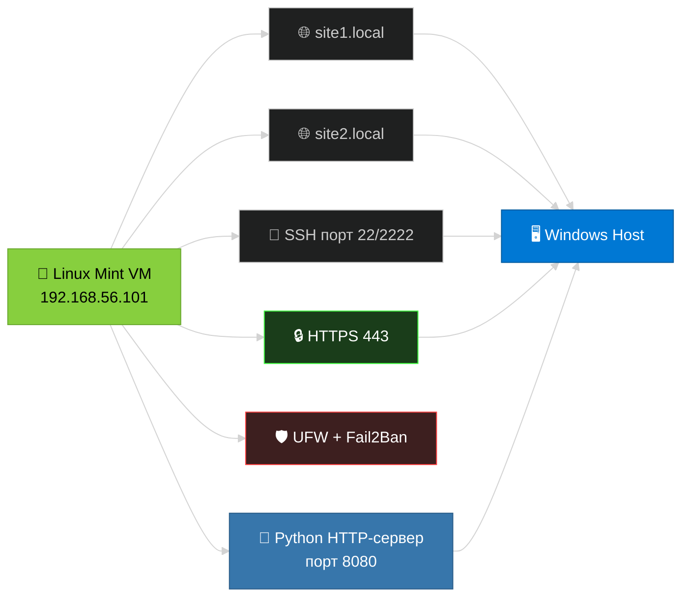

---
*Linux Mint 22 • Oracle VirtualBox 7.x • Nginx 1.24+ • Python 3.10+*  
*Модуль 04 интегрирован из репозитория: [github.com/fa-python-network/6_Web_server](https://github.com/fa-python-network/6_Web_server)*  
*Последнее обновление: Апрель 2026 г.*

</div>
